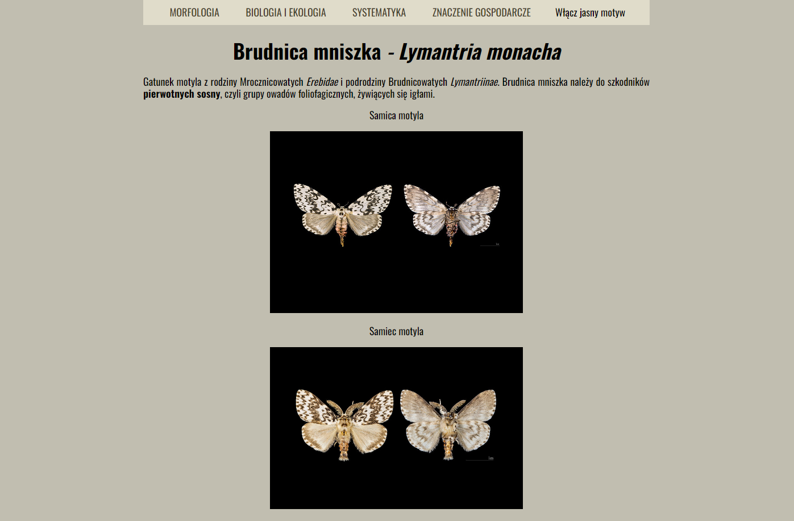

# butterfly_page

## Demo
(https://raphael-1118.github.io/butterfly_page/)

## Screenshot

## Description
This is a simple website about butterfly which is an insect pest od conifers. Basic information was presented about morphology, biology and ecology and economic importance in forests.  

## Used technologies
- HTML
- CSS
- Java Script
- BEM
- Normalize
